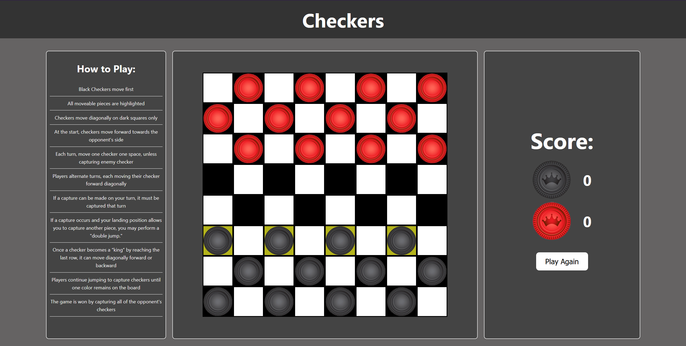

# Checkers-browser-game

  

  # Checkers

  ### [Filler Live Link](https://github.com/Lucas-Sloan/checkers-browser-game)

  ##### Lucas Sloan

  

  ## :pencil: Description

 - The black pieces move first, and all moveable pieces are highlighted for easy gameplay. 
 - Players take turns moving one checker one space diagonally on the dark squares, with the primary objective of advancing their pieces forward towards the opponent's side. 
 - Captures must be made whenever possible during a turn, and successful captures allow for additional "double jumps" if another capture is possible. 
 - When a checker reaches the opponent's last row, it becomes a "king" and gains the ability to move diagonally both forward and backward. 
 - The game is won by capturing all of the opponent's checkers, with players continuing to jump and capture until only one color remains on the board.

 ## :mountain: Background

 - I chose this Checkers game because the alternating turns and board layout reminded me of a tic-tac-toe game I previously created.
 - I enjoyed the challenge of designing the checkerboard pattern. 
 - It involved setting up coordinates, determining possible moves, and implementing the movement and capture logic, all of which were rewarding to figure out.

## :framed_picture: Assets
######  Checker Pieces:
https://www.shutterstock.com/image-vector/checkers-board-game-pieces-vector-260nw-1295130049.jpg

## :desktop_computer: Technologies Used

## :satellite: Future Goals

- [:X:] Toggle Between Single Player and Multiplayer

- [:X:] Have a cpu for Single Players to play against

